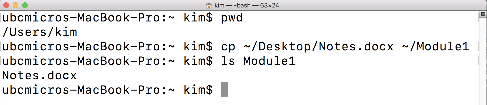

# Introduction to the module

**This module assumes no prior knowledge of the tools used.**

**Learning objectives** After this module, students will be able to:

* Identify uses of command line inside and outside the classroom
* Apply basic syntax and functions in command line
* Use command line to navigate a computer’s file structure

Throughout this tutorial, look for the  to denote lines of code or other steps that you should run on your computer if you are following along.

This module and all materials herein were developed as part of the 
Experiential Data science for Undergraduate Cross-Disciplinary Education ([EDUCE](????????)) initiative at the U. of British Columbia. 

## Download (Windows only)
Prior to starting this module, you will need to download a Linux-based command line terminal. We will use the free, open-source GitBash terminal, which you can download [here](https://git-for-windows.github.io).

Mac machines come with a Linux-based command line terminal pre-installed.

## Troubleshooting

* Try installing Git as an administrator by right-clicking the download and selecting "Run as administrator"
* Try restarting your machine after installation is complete.

# Introduction to command line
## Basic command line
Data science most often deals with big data, as in terabytes worth of it. Specific programs and computers are needed to collect, analyze, and store these data. Many (and in some fields, most) of these tools require the use of command line to either run a program or access a remote super computer. So, a great place to begin in data science if to become familiar with command line. 

**Command-line** allows you to interact with your computer through text-based commands input through a simple program called a **shell**. 

First open a command line window on your computer. This will be the built in command line (Terminal) for Mac or Linux machines

 

or GitBash for Windows machines.

 

If you do not know where this program is on your computer, simply search for the appropriate name in Finder (Mac) or the start menu (Windows).

Throughout this tutorial, you will generally see a Mac Terminal as the example output. If something looks significantly different in GitBash, we will also show this window.

### Command prompt
Notice the `$` symbol in the above windows. This is the command prompt which lets you know that the terminal is ready for you to input your next command. 

### pwd
When you open a new terminal, you will automatically be in your `home` directory. To find out where this is, use `pwd` which stands for **print working directory**. This tells you where your terminal is currently pointing.

 `pwd`

 

We see that we are in `/Users/kim`, which we can also go to in the more commonly used Finder programs on Mac (left) or Windows (right).

 

I will start most Terminal screenshots with `pwd` so that we are able to orient ourselves within the file structure before performing a new step.

### ls
We can also orient ourselves within the current working directory by **listing** all the files in that directory with `ls`.  

 `ls`

 

You can see that the files listed in the terminal are the same as in the Finder window above.

### ls options
For those working in GitBash, you will automatically see some additional information with `ls`.

 

GitBash colors files by type as well as includes indicators at the end of some types. Folders are blue and end in `/`, symbolic links (like shortcuts) are teal and end in `@`, files are grey, etc.

You can ask for these indicators in the Mac/Linux Terminal by adding modifiers to the the `ls` command. You do this with `-` after the command. For example, if we want to show all of the file type indicators, we use `ls -F` to list showing folders.

 

Most commands can be modified with text following a - as in `ls -F`. You can learn more about these modifications by looking up the **manual** of any function with `man` like `man ls`.

 

This will bring up a text documents with every possible modifier of the `ls` function. You then **exit the manual** back to the terminal with `q` for 'quit'.

### mkdir
To stay organized, let's make a directory called 'Module1' for all of our work in today's tutorial. This is done with `mkdir` which stands for **make directory**. 

 `mkdir Module1`

 

The terminal doesn't output anything showing us that this directory was created. If we open Finder (Mac, left) or File Explorer (Windows, right), we can see that we do have a directory named Module1.

### cd
So now that we've made a new directory, we can move into that directory with `cd` for **change directory** and see that we've actually moved with `pwd` again. Note that the command line is *case sensitive* so Module1 =/= module1

 `cd Module1/`
 `pwd`

### Special characters
You then have a couple of options for getting out of this directory. You can go **up one directory** using `cd ..` In this case, we would go back to our home directory since this is one up from our Module1 directory.

 

Or you can go straight to the home directory from anywhere, no matter how many directories up it is from your current location, using `cd ~`. The `~` is shorthand for your **home directory**.

 

Choose one to run on your computer so that you are back in your `home` directory.

 `cd ..`

### cp and mv
We will now add a file to our new `Module1` directory. Choose any file on your computer; I will use `Notes.docx` on my Desktop. We can either **copy** the file with `cp` or **move** it with `mv`. In either case, the syntax is `cp_or_mv where_the_file_is where_you_want_the_file_to_go`

To be safe, I will copy my notes file so that the original remains on my Desktop. I then check that the file has been copied by listing everything in the `Module1` directory with `ls Module1`. You could also check by `cd`ing into `Module1` and then using just `ls`.

 `cp ~/Desktop/Notes.docx ~/Module1`

 `ls Module1`

 

Notice how instead of writing out the entire file path like `Users/kim/Desktop/Notes.docx`, I can use the shortcut `~` for my home directory which is `Users/kim`.

### Renaming
You can also rename files as your copy/move them. Simply give the destination path a new name!

`cp ~/Desktop/Notes.docx ~/Module1/Notes_new.docx`

## Practice
Command line skills come with practice. Start the following exercises in class and then complete outside of class as needed before our next data science tutorial. Please feel free to work together!

1. Move around your computer using the command line. Try to find the following directories.
    + Desktop
    + Downloads
    + Where the Terminal (Mac) or GitBash (Windows) program is installed
    + A USB or other external drive (make sure to plug one into your computer first)
2. Move the `Module1` directory we created today to wherever on your computer you would like it to reside. This could be in "My Documents", on your Desktop, etc.
3. Retrieve a file from the internet and put it in your `Module1` directory using only the command line. *Hint*: you can  `cp` from a web address.
4. Select 1 directory where you would like to improve the organization. Using the command line, reorganize and rename the files within until you are happy with the new structure. Take a screenshot of `ls` within your chosen directory both before and after.