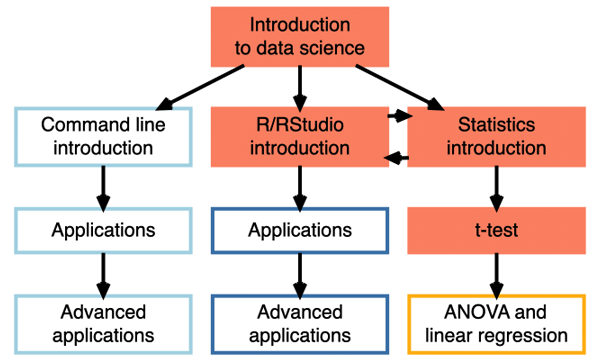
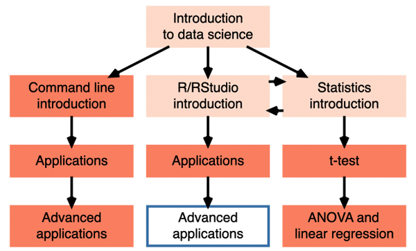
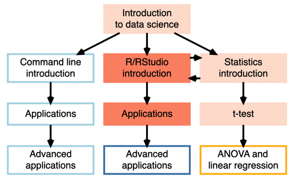
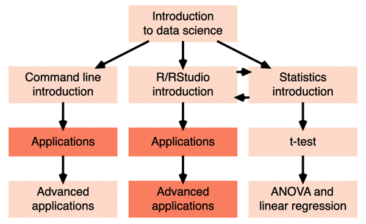

<style> 
  #nudge_up > p {margin-top: -30px;} 
</style>

<script src="https://ajax.googleapis.com/ajax/libs/jquery/1.12.2/jquery.min.js"></script>

<script>
    $(document).ready(function() {
    $('slide:not(.title-slide, .backdrop, .segue)').append('<footer></footer>');    
    $('footer').attr('label', 'Slides at bit.ly/M&I_EDUCE');

  })
</script>

<style>
  footer:after {
    font-size: 16pt;
    content: attr(label);
    position: absolute;
    bottom: 20px;
    left: 500px;
    line-height: 1.9;
    display: block;
  }
</style>

```{r echo=FALSE, message=FALSE, warning=FALSE}
library(tidyverse)
library(ggthemes)
library(scales)
library(DiagrammeR)
#Exact and Monte Carlo symmetry tests for paired contigency tables
library(rcompanion)
```
```{r survey data, echo=FALSE, message=FALSE, warning=FALSE}
# Cleaned in EDUCE/Survey_analysis/Survey_analysis_MICB2019
survey <- read_csv("data/2017.18.19_survey_clean.csv")
```

## Data science

* extracting knowledge and meaning from (big) data

>* statistics, mathematics, computer science

<br>

>* Where do the data come from?

##

```{r echo=FALSE, fig.align="center"}

```

<center><font size="4">(James Montgomery Flagg)</font></center>

## {.flexbox .vcenter}

<center><font size="6">$>$ 90% of researchers in the biological sciences work with or plan to work with big data</font>

<font size="4">(Williams & Teal 2017)</font></center>

## Next-generation sequencing

```{r echo=FALSE, message=FALSE, fig.height=4}
# Plot cost Mb DNA by year
p1 <- read_tsv("data/sequencing_costs_table_july_2017.txt") %>% 
  ggplot(aes(x=Date, y=CostperMb)) +
  geom_line(size=2) +
  # Force y axis limit up to 10,000. ylim and limits did not work
  geom_point(aes(x=as.Date("2001-09-01"), y=10000), color="white") +
  # Label by year
  scale_x_date(date_labels="%Y", date_breaks="1 year") +
  # Log scale cost
  scale_y_continuous(trans="log",
                     labels=comma_format(accuracy=0.1),
                     breaks = c(0.1,1,10,100,1000,10000)) +
  # Beautify
  labs(x="", y="Cost per\n Megabase (USD)") +
  theme_bw() +
  theme(text = element_text(size=20),
        axis.text.x = element_text(angle = 45, hjust = 1))

p1
```

<center><font size="4">(NIH National Human Genome Research Institute)</font></center>

## Next-generation sequencing

```{r echo=FALSE, message=FALSE, fig.height=4}
# Add breaks
p1 +
  geom_vline(xintercept=as.Date("2002-01-01"), size=1, color="steelblue") +
  geom_vline(xintercept=as.Date("2008-01-01"), size=1, color="steelblue") +
  geom_vline(xintercept=as.Date("2014-01-01"), size=1, color="steelblue")
```

<center><font size="4">(NIH National Human Genome Research Institute)</font></center>

## Next-generation sequencing

```{r echo=FALSE, message=FALSE, fig.height=4}
# Add PhD timeline
p1 +
  geom_vline(xintercept=as.Date("2002-01-01"), size=1, color="steelblue") +
  geom_vline(xintercept=as.Date("2008-01-01"), size=1, color="steelblue") +
  geom_vline(xintercept=as.Date("2014-01-01"), size=1, color="steelblue") +
  annotate("text", label="1 PhD unit", x=as.Date("2011-01-01"), y=10000, size=8)
```

<center><font size="4">(NIH National Human Genome Research Institute)</font></center>

## {.flexbox .vcenter}

<center><font size="6">$>$ 60% of researchers in the biological sciences report a need for more training in data science</font>

<font size="4">Meta-analysis 2013 - 2016  
(Attwood _et al_ 2017)</font></center>

## Not just academia

```{r echo=FALSE, fig.align="center"}

```

# We need to teach<br>data science in undergraduate life<br>science curriculum.

## Barriers to data science integration
  
>1. Faculty training
2. Student interest 
3. Student preparation in mathematics, statistics, and computer science
4. Already overly full curricula
5. Limited access to resources (hardware, software)

<font size="4">(Williams _et al_ 2017)</font>

## 
<div style="float: left; width: 40%;">

<br>

<br>


</div>

<div style="float: left; width: 60%;">

<br>

<br>

<font size="6"><span style="color:teal">**E**</span>xperiential  
<span style="color:teal">**D**</span>ata science for  
<span style="color:teal">**U**</span>ndergraduate  
<span style="color:teal">**C**</span>ross-disciplinary  
<span style="color:teal">**E**</span>ducation</font>

<br>
<br>
<br>

</div>

## Our goal {.flexbox .vcenter}

<center><font size="6">Modular integration of  
data science curriculum into  
existing courses  
</font></center>

## Content overview
```{r echo=FALSE, message=FALSE, fig.align="center"}
grViz("
      digraph {
      # Base statements
      node[shape=box, fontname=Helvetica,
      width=2, penwidth=3, fontsize=16, color=grey]
      A
      
      # Cmd line statements
      node[shape=box, fontname=Helvetica,
      width=2, penwidth=3, fontsize=16, color=lightblue]
      B;D;E
      
      # R statements
      node[shape=box, fontname=Helvetica,
      width=2, penwidth=3, fontsize=16, color=steelblue]
      F;H;I
      
      # Stat statements
      node[shape=box, fontname=Helvetica,
      width=2, penwidth=3, fontsize=16, color=darkgoldenrod1]
      J;L;M
      
      # edges
      edge [color = black, arrowhead = vee, arrowtail = vee, penwidth=3]
      
      # edgestatements
      A->{B F J}
      B->D D->E
      F->H H->I
      J->L L->M
      J->F F->J
      
      # define ranks
      subgraph {rank = same; B;F;J}
      
      # define labels
      A[label='Introduction \nto data science']
      
      B[label='Command line \nintroduction']
      D[label='Applications']
      E[label='Advanced \napplications']
      
      F[label='R/RStudio \nintroduction']
      H[label='Applications']
      I[label='Advanced \napplications']
      
      J[label='Statistics \nintroduction']
      L[label='t-test']
      M[label='ANOVA and \nlinear regression']
      }
      ")
```

## Course overview
```{r echo=FALSE, message=FALSE, fig.align="center", fig.width=8}
grViz("
      digraph {
      
      graph [layout=dot,
            rankdir = LR]

      # 3rd year statements
      node[shape=box, fontname=Helvetica,
      width=2, height=1.3, penwidth=3, fontsize=16, color=lightblue]
      A;B;C

      # 4th year statements
      node[shape=box, fontname=Helvetica,
      width=2, penwidth=3, fontsize=16, color=darkgoldenrod1]
      D;E;F;G 

      # BCIT statement
      node[shape=box, fontname=Helvetica,
      width=2, penwidth=3, fontsize=16, color=lightblue]
      H

      # edges
      edge [color = black, arrowhead = vee, arrowtail = vee, penwidth=3]
      
      # edgestatements
      A->B B->A
      A->{D G}
      B->C
      C->{E F D G}
      {D E F G}->H[dir=back]
      B->{D G}

      # define ranks
      subgraph {rank = same; A}
      subgraph {rank = same; D;E}
      subgraph {rank = same; F;G}

      # define labels
      A[label='Microbial \nEcophysiology \nMICB 301']
      B[label='Molecular Microbiology \nLaboratory \nMICB 322']
      C[label='Molecular Immunology \nand Virology Laboratory \nMICB 323']
      D[label='Bioinformatics \nMICB 405']
      E[label='Experimental \nMolecular Biology \nMICB 447']
      F[label='Experimental \nMicrobiology \nMICB 421']
      G[label='Microbial Ecological \nGenomics \nMICB 425']
      H[label='UBC/BCIT \nBiotechnology \nprogram']
    }
")
```

## Students impacted per year {#nudge_up}
```{r echo=FALSE, message=FALSE, warning=FALSE, fig.align="center", fig.height=5, fig.width=8.5}
read_tsv("data/2018_course_makeup.txt") %>% 
  # Add total summed variable
  mutate(Total = rowSums(.[2:8], na.rm=TRUE)) %>% 
  # Reoder majors factor
  mutate(major_ord = factor(Major, levels=c("MS/PhD","Other Faculties","Other Science","BIOT","CPSC","MICB/MBIM"))) %>% 

  # Gather
  gather(key=course, value=count, "301":"447", Total) %>% 
  na.omit() %>% 
  
  ggplot() + 
  geom_point(aes(x=as.factor(course), y=major_ord, 
                 size=as.numeric(count), color=as.factor(course))) +
  # Size parameters, modify legend
  scale_size_continuous(name="Number \nof students", range = c(0,20),
                        limits=c(0,356), breaks=c(5,10,20,40,80,160,320)) +
  # Remove color legend
  scale_color_discrete(guide=FALSE) +
  # Add vertical dividers
  geom_vline(xintercept=7.4, size=1) +
  #Beautify
  labs(x="MICB course", y="Undergraduate major") +
  theme_bw(base_size = 16) +
  theme(text = element_text(size=20)) +
  scale_y_discrete(labels=c("MS / PhD", "Other\nFaculties", "Other\nScience", "Biotech", "Computer\nScience", "M&I"))
```

## Example student

## MICB 301
```{r echo=FALSE, message=FALSE, fig.align="center"}
grViz("
      digraph {
      # Cmd line statements
      node[shape=box, fontname=Helvetica,
      width=2, penwidth=3, fontsize=16, color=lightblue]
      B;D;E
      
      # R statements
      node[shape=box, fontname=Helvetica,
      width=2, penwidth=3, fontsize=16, color=steelblue]
      H;I
      
      # Stat statements
      node[shape=box, fontname=Helvetica,
      width=2, penwidth=3, fontsize=16, color=darkgoldenrod1]
      M
      
      # Student example
      node[shape=box, fontname=Helvetica,
      width=2, penwidth=3, fontsize=16, color='#fc9272', style=filled]
      A;F;J;L

      # edges
      edge [color = black, arrowhead = vee, arrowtail = vee, penwidth=3]
      
      # edgestatements
      A->{B F J}
      B->D D->E
      F->H H->I
      J->L L->M
      J->F F->J
      
      # define ranks
      subgraph {rank = same; B;F;J}
      
      # define labels
      A[label='Introduction \nto data science']
      
      B[label='Command line \nintroduction']
      D[label='Applications']
      E[label='Advanced \napplications']
      
      F[label='R/RStudio \nintroduction']
      H[label='Applications']
      I[label='Advanced \napplications']
      
      J[label='Statistics \nintroduction']
      L[label='t-test']
      M[label='ANOVA and \nlinear regression']
      }
      ")
```

## MICB 301 - 322
```{r echo=FALSE, message=FALSE, fig.align="center"}
grViz("
      digraph {
      # Cmd line statements
      node[shape=box, fontname=Helvetica,
      width=2, penwidth=3, fontsize=16, color=lightblue]
      B;D;E
      
      # R statements
      node[shape=box, fontname=Helvetica,
      width=2, penwidth=3, fontsize=16, color=steelblue]
      I
      
      # Stat statements
      node[shape=box, fontname=Helvetica,
      width=2, penwidth=3, fontsize=16, color=darkgoldenrod1]
      M
      
      # Student example
      node[shape=box, fontname=Helvetica,
      width=2, penwidth=3, fontsize=16, color='#fc9272', style=filled]
      F;H

      node[shape=box, fontname=Helvetica,
      width=2, penwidth=3, fontsize=16, color='#fee0d2', style=filled]
      A;J;L

      # edges
      edge [color = black, arrowhead = vee, arrowtail = vee, penwidth=3]
      
      # edgestatements
      A->{B F J}
      B->D D->E
      F->H H->I
      J->L L->M
      J->F F->J
      
      # define ranks
      subgraph {rank = same; B;F;J}
      
      # define labels
      A[label='Introduction \nto data science']
      
      B[label='Command line \nintroduction']
      D[label='Applications']
      E[label='Advanced \napplications']
      
      F[label='R/RStudio \nintroduction']
      H[label='Applications']
      I[label='Advanced \napplications']
      
      J[label='Statistics \nintroduction']
      L[label='t-test']
      M[label='ANOVA and \nlinear regression']
      }
      ")
```

## MICB 301 - 322 - 405
```{r echo=FALSE, message=FALSE, fig.align="center"}
grViz("
      digraph {
      # R statements
      node[shape=box, fontname=Helvetica,
      width=2, penwidth=3, fontsize=16, color=steelblue]
      I
      
      # Student example
      node[shape=box, fontname=Helvetica,
      width=2, penwidth=3, fontsize=16, color='#fc9272', style=filled]
      B;D;L;M;E;H

      node[shape=box, fontname=Helvetica,
      width=2, penwidth=3, fontsize=16, color='#fee0d2', style=filled]
      A;F;J

      # edges
      edge [color = black, arrowhead = vee, arrowtail = vee, penwidth=3]
      
      # edgestatements
      A->{B F J}
      B->D D->E
      F->H H->I
      J->L L->M
      J->F F->J
      
      # define ranks
      subgraph {rank = same; B;F;J}
      
      # define labels
      A[label='Introduction \nto data science']
      
      B[label='Command line \nintroduction']
      D[label='Applications']
      E[label='Advanced \napplications']
      
      F[label='R/RStudio \nintroduction']
      H[label='Applications']
      I[label='Advanced \napplications']
      
      J[label='Statistics \nintroduction']
      L[label='t-test']
      M[label='ANOVA and \nlinear regression']
      }
      ")
```

## MICB 301 - 322 - 405 - 425
```{r echo=FALSE, message=FALSE, fig.align="center"}
grViz("
      digraph {
      # Student example
      node[shape=box, fontname=Helvetica,
      width=2, penwidth=3, fontsize=16, color='#fc9272', style=filled]
      H;I;D

      node[shape=box, fontname=Helvetica,
      width=2, penwidth=3, fontsize=16, color='#fee0d2', style=filled]
      A;B;E;F;J;L;M

      # edges
      edge [color = black, arrowhead = vee, arrowtail = vee, penwidth=3]
      
      # edgestatements
      A->{B F J}
      B->D D->E
      F->H H->I
      J->L L->M
      J->F F->J
      
      # define ranks
      subgraph {rank = same; B;F;J}
      
      # define labels
      A[label='Introduction \nto data science']
      
      B[label='Command line \nintroduction']
      D[label='Applications']
      E[label='Advanced \napplications']
      
      F[label='R/RStudio \nintroduction']
      H[label='Applications']
      I[label='Advanced \napplications']
      
      J[label='Statistics \nintroduction']
      L[label='t-test']
      M[label='ANOVA and \nlinear regression']
      }
      ")
```

## Example student

<div style="float: left; width: 50%;">
```{r echo=FALSE, fig.align="center", fig.cap="MICB 301"}

```
```{r echo=FALSE, fig.align="center", fig.cap="MICB 405"}

```
</div>

<div style="float: right; width: 50%;">
```{r echo=FALSE, fig.align="center", fig.cap="MICB 322"}

```
```{r echo=FALSE, fig.align="center", fig.cap="MICB 425"}

```
</div>

## Solutions to integration
  
1. Faculty training

>* _Dedicated Postdoctoral Teaching and Learning Fellow_
* _Cross-disciplinary TAs from multiple departments_

<br>

2.[] Student interest 

>* _Direct connections to other course curricula_
>* _Hands-on, experiential learning_

## Solutions to integration

3.[] Student preparation

>* _No prior knowledge assumed_

<br>

4.[] Already overly full curricula

>* _No new courses required_

<br>

5.[] Limited access to resources

>* _Stripped down datasets and use of cloud resources_
>* _Open-source tools and curricula_

# Does EDUCE effectively teach data science skills<br>to M&I students?
# MICB 301<br>as a case study
## EDUCE in MICB 301

* 5 x 50 min class sessions across 5 weeks
* Weekly assignments and a final report

<br>

* Introduction to
    - data science
    - R/RStudio
    - statistics

* Simple plots and running a *t*-test in R

## Increased interest in data science {#nudge_up}
How would you rate your interest in...

<br>

```{r interest, echo=FALSE, message=FALSE, warning=FALSE, fig.height=4.75, fig.width=8.5}
interest <- survey %>% 
  select(Course, year,
         Pre_Interest_BI, Post_Interest_BI,
         Pre_Interest_CPSC, Post_Interest_CPSC) %>% 
  filter(Course== "MICB301") %>% 
  # Select matched pre-post
  drop_na() %>% 
  #Gather pre/post data
  gather("subject", "interest", -Course, -year) %>% 
  drop_na(interest) %>% 
  # Create separate pre/post column
  separate(subject, into=c("survey","trash","subject"), sep="_") %>% 
  # Convert numeric survey respones to groups
  ## None=0, low=1-3, med=4-7, high=8-10
  mutate(interest_cat = ifelse(interest == "0", "None",
                        ifelse(interest %in% c("1","2","3"), "Low",
                        ifelse(interest %in% c("4","5","6","7"), "Medium",
                        ifelse(interest %in% c("8","9","10"), "High",
                        interest))))) %>% 
  #Reorder groups
  mutate(survey =  factor(survey, levels = c("Pre", "Post")),
         interest_cat = factor(interest_cat,
                               levels=c("High","Medium","Low","None"))) %>% 
  select(-trash) %>% 
  group_by(Course, survey, subject, interest_cat) %>% 
  summarize(n=n()) %>% 
  mutate(freq=100*n/sum(n))

p_interest <- ggplot(interest, aes(x=survey, y=freq, fill=interest_cat)) + 
  geom_col(position = "fill") +
  labs(x="Survey", y="Proportion of responses", fill="") +
  facet_grid(~subject, labeller = as_labeller(c("BI"="Bioinformatics\n", "CPSC"="Computer science\n"))) +
  theme_bw(base_size = 16) +
  theme(text = element_text(size=20), 
        panel.spacing = unit(2, "lines")) +
  scale_x_discrete(labels=c("Pre","Post")) +
  scale_fill_brewer(palette = "Blues", direction=-1)+
  scale_y_continuous(labels=scales::percent)

p_interest
```

## Increased interest in data science {#nudge_up}
How would you rate your interest in...

<br>

```{r interest2, echo=FALSE, message=FALSE, warning=FALSE, fig.height=4.75, fig.width=8.5}
p_interest +
  geom_segment(aes(x = 1, y = 0.5, xend = 2, yend = 0.8),
  arrow = arrow(length = unit(0.03, "npc"))) +
  facet_grid(~subject, labeller = as_labeller(c("BI"="Bioinformatics\nP = 0.023", "CPSC"="Computer science\nP = 0.093")))
```

## Except... {.flexbox .vcenter}

<center><font size="6">No significant changes in interest in statistics</font></center>

## Increased experience in data science {#nudge_up}
What level of experience do you have in ...

<br>

```{r exp, echo=FALSE, message=FALSE, warning=FALSE, fig.height=4.75, fig.width=8.5}
exp <- survey %>% 
  select(Course, year,
         Pre_Exp_BI,   Post_Exp_BI,
         Pre_Exp_CPSC, Post_Exp_CPSC) %>% 
  filter(Course == "MICB301") %>% 
  # Select matched pre-post
  drop_na() %>% 
  #Gather pre/post data
  gather("subject", "exp", -Course, -year) %>% 
  # Create separate pre/post column
  separate(subject, into=c("survey","trash","subject"), sep="_") %>% 
  # Convert numeric survey respones to groups
  ## None=0, low=1-3, med=4-7, high=8-10
  mutate(exp_cat = ifelse(exp == "0", "None",
                        ifelse(exp %in% c("1","2","3"), "Low",
                        ifelse(exp %in% c("4","5","6"), "Medium",
                        ifelse(exp %in% c("7","8"), "High",
                        ifelse(exp %in% c("9","10"), "veryHigh",
                        exp)))))) %>% 
  #Reorder groups
  mutate(survey =  factor(survey, levels = c("Pre", "Post")),
         exp_cat = factor(exp_cat,
                               levels=c("veryHigh","High","Medium","Low","None")),
         subject = factor(subject, levels=c("BI","CPSC"))) %>% 
  select(-trash) %>% 
  group_by(Course, survey, subject, exp_cat) %>% 
  summarize(n=n()) %>% 
  mutate(freq=100*n/sum(n))

p_exp <- ggplot(exp, aes(x=survey, y=freq)) + 
  geom_col(aes(fill=exp_cat), position = "fill") +
  labs(x="Survey", y="Proportion of responses", fill="") +
  facet_grid(~subject, labeller = as_labeller(
    c("BI"="Bioinformatics \n\n\n",
      "CPSC"="Computer science \n\n\n"))) +
  theme_bw(base_size = 16) +
  theme(text = element_text(size=20), 
        panel.spacing = unit(2, "lines")) +
  scale_x_discrete(labels=c("Pre","Post")) +
  scale_fill_brewer(palette = "Blues", direction=-1, 
                    labels=c("Very high","High","Medium","Low","None")) +
  scale_y_continuous(labels=scales::percent)

p_exp
```

## Increased experience in data science {#nudge_up}
What level of experience do you have in ...

<br>

```{r exp2, echo=FALSE, message=FALSE, warning=FALSE, fig.height=4.75, fig.width=8.5}
arrow_bi<-data.frame(
  x=1,xend=2, y1=0.6,yend1=0.85, y2=0.2,yend2=0.35, y3=0.2,yend3=0.8, 
  subject=factor("BI", levels=c("BI","CPSC","MICB")))

arrow_cpsc<-data.frame(
  x=1, xend=2, y1=0.2,yend1=0.4, y2=0.5,yend2=0.75,
  subject=factor("CPSC", levels=c("BI","CPSC","MICB")))

p_exp +
  geom_segment(data=arrow_bi, aes(x=x, y=y1, xend=xend, yend=yend1), 
               arrow = arrow(length = unit(0.03, "npc"))) +
  geom_segment(data=arrow_bi, aes(x=x, y=y2, xend=xend, yend=yend2), 
               arrow = arrow(length = unit(0.03, "npc"))) +
  geom_segment(data=arrow_bi, aes(x=x, y=y3, xend=xend, yend=yend3), 
               arrow = arrow(length = unit(0.03, "npc"))) +
  
  geom_segment(data=arrow_cpsc, aes(x=x, y=y1, xend=xend, yend=yend1), 
               arrow = arrow(length = unit(0.03, "npc"))) +
  geom_segment(data=arrow_cpsc, aes(x=x, y=y2, xend=xend, yend=yend2), 
               arrow = arrow(length = unit(0.03, "npc"))) +
  
facet_grid(~subject, labeller = as_labeller(
    c("BI"="Bioinformatics\n P = 3.23E-2\n P = 3.29E-5\n P = 6.15E-8",
      "CPSC"="Computer science\n P = 1.94E-3\n P = 7.44E-2\n ")))
```

## Except... {.flexbox .vcenter}

<center><font size="6">No significant changes in experience in statistics</font></center>

## Conclusions

>* Data science literacy is needed in the life sciences

>* EDUCE provides a flexible, modular approach for integrating data science into undergraduate curriculum

>* Even minimal exposure (5 hours) can increase student self-reported interest and experience in data science areas 

## The future

* A wealth of survey data to mine

* Repetition across 3 years for statistical analyses

* More courses? Other departments? 

* Faculty of Science Data Science Committee

## Acknowledgements {#nudge_up}
<div style="float: left; width: 50%;">

**Steven Hallam**  
**Jennifer Bonderoff**

### *EDUCE TAs*

**Yue Liu (App MATH)**  
Julia Beni (U. Minnesota)  
Kris Hong (CPSC, STAT)  
Jonah Lin (MICB, CPSC)  
Lisa McEwen (MedGen)  
Ryan McLaughlin (BINFO)  
Connor Morgan-Lang (BINFO)  
Nolan Shelley (Botany)  
David Yin (CPSC, STAT)

</div>

<div style="float: right; width: 50%;">
### *Course instructors*

Sean Crowe  
Lindsay Eltis  
Jennifer Gardy  
Marcia Graves  
Martin Hirst  
Bill Mohn  
Dave Oliver  
Jen Sibley

### *Collaborators*

Gaby Cohen-Freue (STAT)  
Patrick Walls (MATH)  
Biljana Stojkova (ASDa)

</div>

## Funding

UBC Teaching and Learning Enhancement Fund (TLEF)

NSERC CREATE Program (ECOSCOPE)

Department of Microbiology & Immunology

UBC Skylight and the Center for Teaching, Learning and Technology (CTLT)

## Opportunities at UBC

**Postdoctoral Teaching and Learning Fellow**

* EDUCE  
<http://ecoscope.ubc.ca/program-structure/educe/educe-postdoctoral-application>

<br>

* Master of Data Science  
<https://www.stat.ubc.ca/postdoctoral-teaching-and-learning-fellow-ubc-master-data-science-program-0>


## References
Attwood TK _et al_ 2017. _A global perspective on evolving bioinformatics and
data science training needs._ Brief Bioinform. 20(2):398-404. doi: [10.1093/bib/bbx100](https://www.ncbi.nlm.nih.gov/pubmed/28968751)

Williams JJ _et al_ 2017. _Barriers to integration of bioinformatics into undergraduate life sciences education._ BioRxiv. doi: [10.1101/204420](https://www.biorxiv.org/content/10.1101/204420v1)

Williams JJ & Teal TK. 2017. _A vision for collaborative training infrastructure
for bioinformatics._ Ann N Y Acad Sci. 1387(1):54-60_ doi: [10.1111/nyas.13207](https://www.ncbi.nlm.nih.gov/pubmed/27603332)


## GenBank sequences
```{r echo=FALSE, message=FALSE, fig.height=3}
read_tsv("data/GanBank_seqs.txt") %>% 
  filter(Date <= as.Date("2018-12-31")) %>% 
  
  ggplot(aes(x=Date, y=Bases)) +
  geom_point() +
  geom_line() +
  # Force y axis limit up to 10,000. ylim and limits did not work
  geom_point(aes(x=as.Date("1982-12-01"), y=1000000000000), color="white") +
  # Label by year
  scale_x_date(date_labels="%Y", date_breaks="2 year") +
  # Log scale cost
  scale_y_continuous(trans="log",
                     labels=scientific,
                     breaks=c(1E6,1E8,1E10,1E12)) +
  # Beautify
  labs(x="", y="Total basepairs\nin GenBank") +
  theme_bw() +
  theme(text = element_text(size=20),
        axis.text.x = element_text(angle = 45, hjust = 1))
```

## Undergraduate programs
<div style="float: left; width: 50%;">
### BSc in Bioinformatics

* U. of Montreal
* U. Saskatchewan
* U. Calgary
* Carleton U.

### Joint BSc degrees

* Simon Fraser U.
* U. of British Columbia

</div>

<div style="float: right; width: 50%;">
### Specializations / minors

* Dalhousie U.
* McGill U.
* U. of Toronto
* U. of Victoria
* U. of Waterloo
* U. of Western Ontario

</div>

## MDS programs
```{r echo=FALSE, message=FALSE, fig.height=4}
# https://analytics.ncsu.edu/?page_id=4184
dat <- data.frame(
  year = seq(as.Date("2012-01-01"), as.Date("2019-12-31"), by="years"),
  total = c(0,4,12,28,35,56,69,73)
)
  
dat %>% 
  ggplot(aes(x=year, y=total)) +
  geom_col(fill="steelblue") +
  # Label by year
  scale_x_date(date_labels="%Y", date_breaks="1 year") +
  
  # Beautify
  labs(x="", y="Total US programs") +
  theme_bw() +
  theme(text = element_text(size=20),
        axis.text.x = element_text(angle = 45, hjust = 1))
```

<center><font size="4">(Michael Rappa, NC State University)</font></center>


## Some prior experience {#nudge_up}
```{r echo=FALSE, message=FALSE, warning=FALSE, fig.height=5, fig.width=8}
survey %>% 
  select(Course, Prev_unix, Prev_R, Prev_R, year) %>% 
  filter(Course %in% c("MICB301", "MICB405", "MICB425"),
         year=="2017/18") %>% 
  #Gather pre/post data
  gather("group", "YN", Prev_unix, Prev_R) %>% 
  mutate(YN = ifelse(is.na(YN), "No","Yes")) %>% 

ggplot(aes(x=Course, fill=YN)) + 
  geom_bar(position = "fill") +
  labs(x="Course", y="Proportion of responses", fill="") +
  facet_wrap(~group, labeller=as_labeller(c("Prev_R"="Previous R experience", "Prev_unix"="Previous Unix experience"))) +
  theme_bw(base_size = 16) +
  theme(text = element_text(size=20), 
        panel.spacing = unit(2, "lines")) +
  scale_x_discrete(labels=c("301","405","425"))
```

## Minimal prior knowledge {#nudge_up}
Have you heard the term 'data science'? 

<br>

```{r echo=FALSE, message=FALSE, warning=FALSE, fig.height=4.55, fig.width=8.5}
survey %>% 
  select(Course, Pre_DS, Post_DS, year) %>% 
  filter(Course %in% c("MICB301", "MICB405", "MICB425")) %>% 
  #Gather pre/post data
  gather("group", "DS", Pre_DS,Post_DS) %>% 
  drop_na(DS) %>% 
  #Reorder groups
  mutate(group =  factor(group, levels = c("Pre_DS", "Post_DS"))) %>%

ggplot(aes(x=group, y=..prop.., group=DS, fill=DS)) + 
  geom_bar(position = "fill") +
  labs(x="Survey", y="Proportion of responses", fill="")+
  facet_grid(year~Course) +
  theme_bw(base_size = 16) +
  theme(text = element_text(size=20), 
        panel.spacing = unit(2, "lines")) +
  scale_x_discrete(labels=c("Pre","Post"))
```
